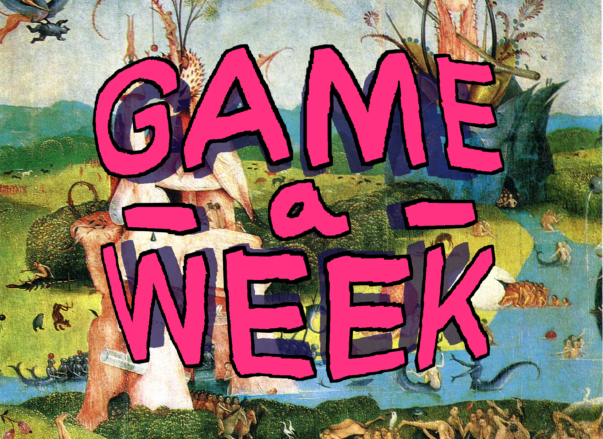
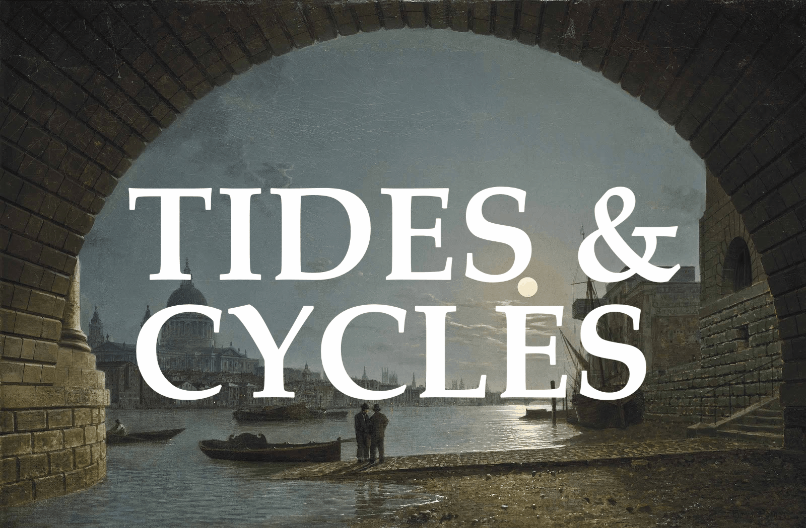
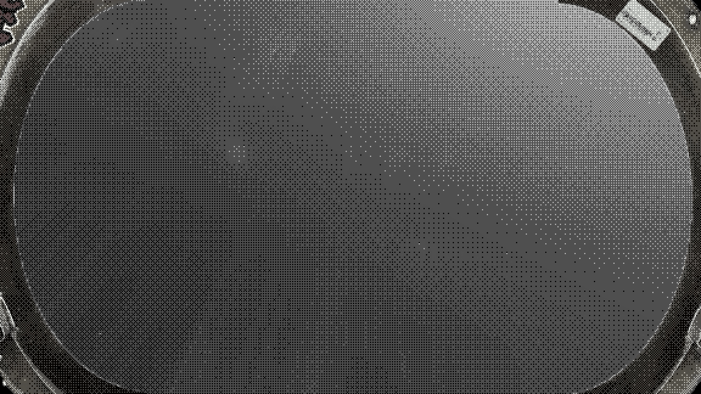
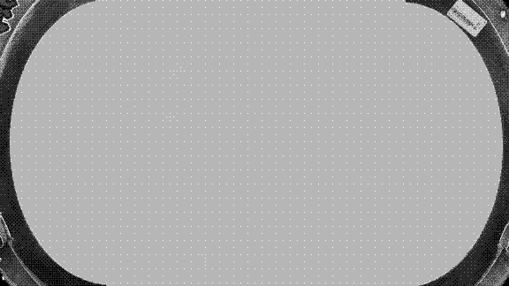

# Game-A-Week 2026: Week 4

| |  
|---|---|

> Game-A-Week is an intensive program in which participants will create 6 prototype games or works - one each week. The aims of Game-A-Week are multifaceted and center around the benefits of “sketching” - something not practiced as often in games as other arts. With your “sketches”, you’ll practice working on small scope ideas, experimenting in a low stakes and supportive environment, practice receiving feedback and help discover and develop your own taste as an artist. Drawing influence from game jams, Game-A-Week will prompt you with weekly thematic, aesthetic, or mechanical constraints (e.g. “time” or “black-and-white” or “one-button input”).

## Theme: Tides & Cycles

> The power and beauty of  the ocean is something humanity has waxed lyrical about for all of time. The moon, our nearest celestial neighbor, is much the same. Both the ocean and the moon are frequently represented in culture as divine representations of feminine power, beauty and even rage. Together, the moon and the ocean create the tides of our Earth. The tides are an immense cyclical clockwork that takes place worldwide, every passing hour, affecting every living creature in some way. Humanity reveres the tide, works with it and fears it.  Let’s make some games about it!

## Game: ???

*This write-up was written after GAW26 concluded, with more retrospective notes*

My game for this week is less a game, more of an art piece, with no input from the player, and the theme lies more in my grander ideas than in the final product. Definitely more sparse than my other submissions, but aesthetically compelling.

The game features a gradual ascent through thick cloud cover on the edge of a planet's atmosphere, breaking out into the space above, and witnessing a rare light phenomenon. I initially had in mind to include accompanying dialogue, between a space traveller and a loved one back on ground. Their conversation would shed light on the light phenomenon (waves), and the rarity of its occurance, visible for only a small window every X years (cycles). They're very lucky to be able to see it. 

Ultimately, I got very sidetracked and demotivated this week, and didn't end up satisfied enough with my writing to justify working on a fittingly styled dialogue system. The visuals are beautiful enough.

The final piece added a rough "porthole" style window, indicating that the player is viewing from inside a ship. I think it looks a *little* goofy, but almost in a point-and-click adventure game style, which is fun. the dither helps. A few seconds are spent enshrouded in fog, with lights outside a result of strange weather phenomena, and the ship moving at pace. I wanted this part of the game to feel eerie, not being sure whats outside, or why nothing is visible. The slow spin of the camera really makes me feel like I'm floating.

I held the music back until the player had broken through, fading in to really highlight the grandure of the sights ahead. The main sample has been lying in my library for years, and is a recording of my Behringer Crave played through my BOSS RC-3 loop pedal. I've never found a good use for it, until now. The drums might be a tad too strong, undecided. The humming sounds of the ship are cut abruptly to indicate crossing the threshold into space. 

An earlier version of the game did not have the dither filter, and was just the raw aurora shader floating in front of the HDRI, with a slow panning camera and no music. I still like looking at the game without the overlay, since some of the colours are very beautiful. Ultimately glad I went with the shaders, since the gradual reveal as you travel through the planet's cloud cover feels very very good to me.

## Acknowledgements
- [Dither Gradient Shader (updated for 4.5 – original by SamBigos) by cpt_metal / sambigos](https://godotshaders.com/shader/dither-gradient-shader-updated-for-4-5-original-by-sambigos/)
- [HDR Multi Nebulae 1](https://www.spacespheremaps.com/hdr-spheremaps/) from ToynS on spacespheremaps.com
- [Aurora Borealis](https://godotshaders.com/shader/aurora-borealis/) shader by miskatonicstudio
- rowan, for giving me a lot of encouragement on this one
- that dog that went to space